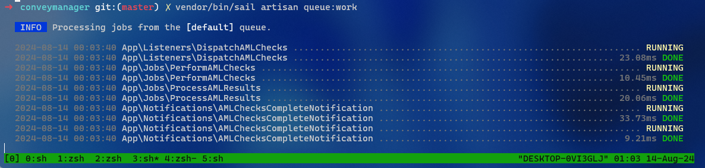
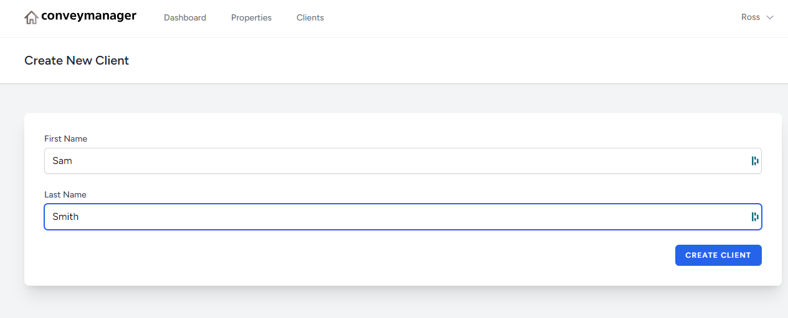
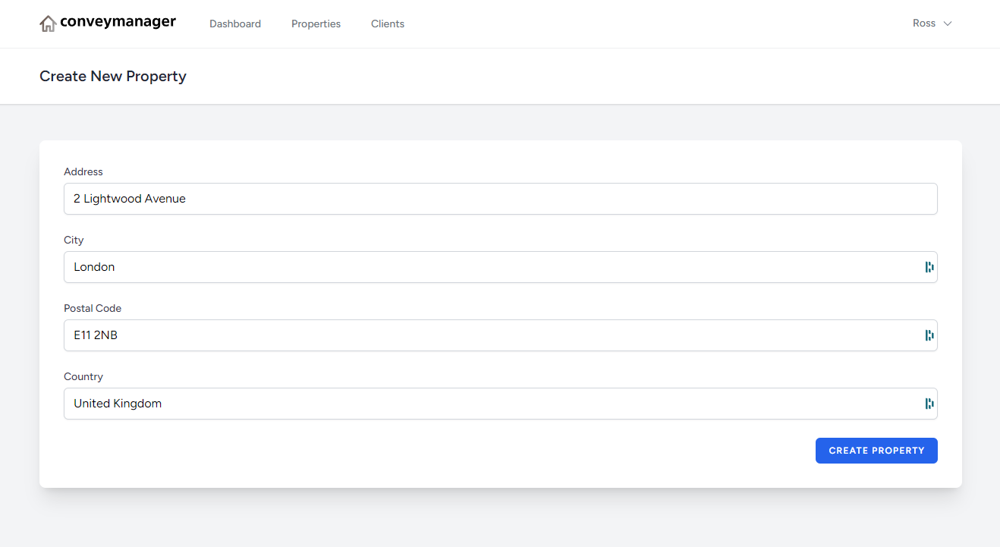
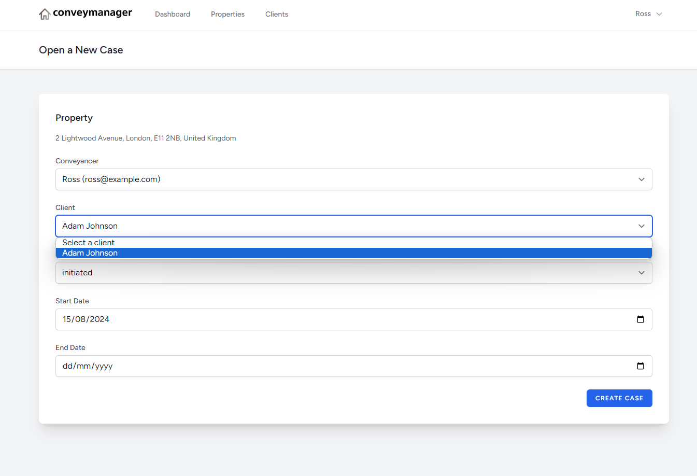
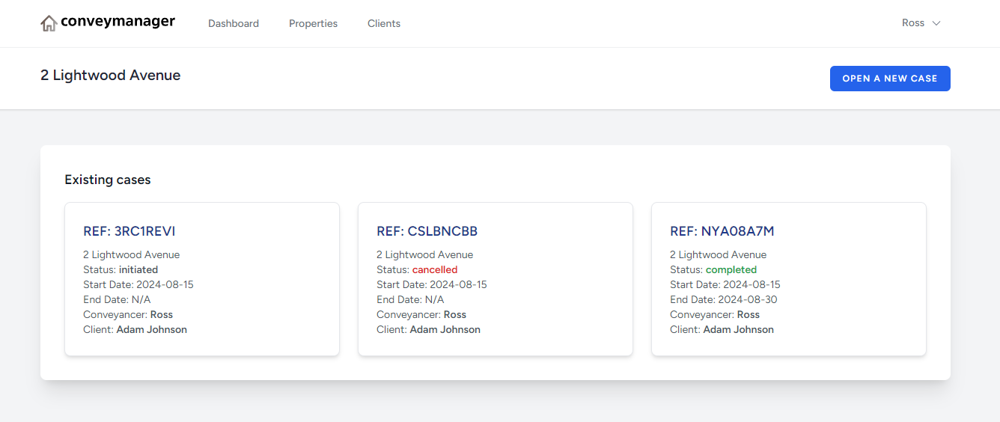
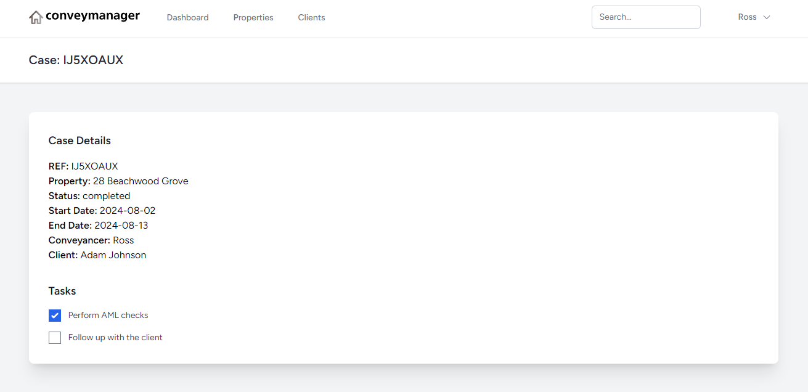

# Example Work Overview

Below are screenshots that demonstrate the different features, along with references to the related code files.

## Conveyancing Manager

This is a Laravel 11, Intertia + VueJS 3 installation with a few fundementals that were discussed previously.

**Related Code Files:**
- `routes/web.php`

## Jobs 

There are a few jobs, listeners and notifications within this demonstration.

**Related Code Files:**
- `app/Listeners/DispatchAMLChecks.php`
- `app/Jobs/PerformAMLChecks.php` 
- `app/Jobs/ProcessAMLResults.php`
- `app/Notifications/AMLChecksCompleteNotification.php`

## Add Clients

This section allows users to add new clients to the system.

**Related Code Files:**
- `resources/js/Pages/Clients/Create.vue`
- `app/Http/Controllers/ClientController.php`

## Create Property

Conveyancers / Admins can create new properties.

**Related Code Files:**
- `resources/js/Pages/Property/Create.vue`
- `app/Http/Controllers/PropertyController.php`

## Open Cases

Open cases within a property.

**Related Code Files:**
- `resources/js/Pages/ConveyancingCase/Create.vue`
- `app/Http/Controllers/CaseController.php`

## Show Property Cases

Users can navigate through different cases to view details or make updates.

**Related Code Files:**
- `resources/js/Pages/Property/Show.vue`
- `app/Http/Controllers/CaseController.php`

## Update Cases and Tasks

This feature allows users to update tasks related to a specific case.

**Related Code Files:**
- `resources/js/Pages/ConveyancingCase/Edit.vue` 
- `app/Http/Controllers/TaskController.php`

