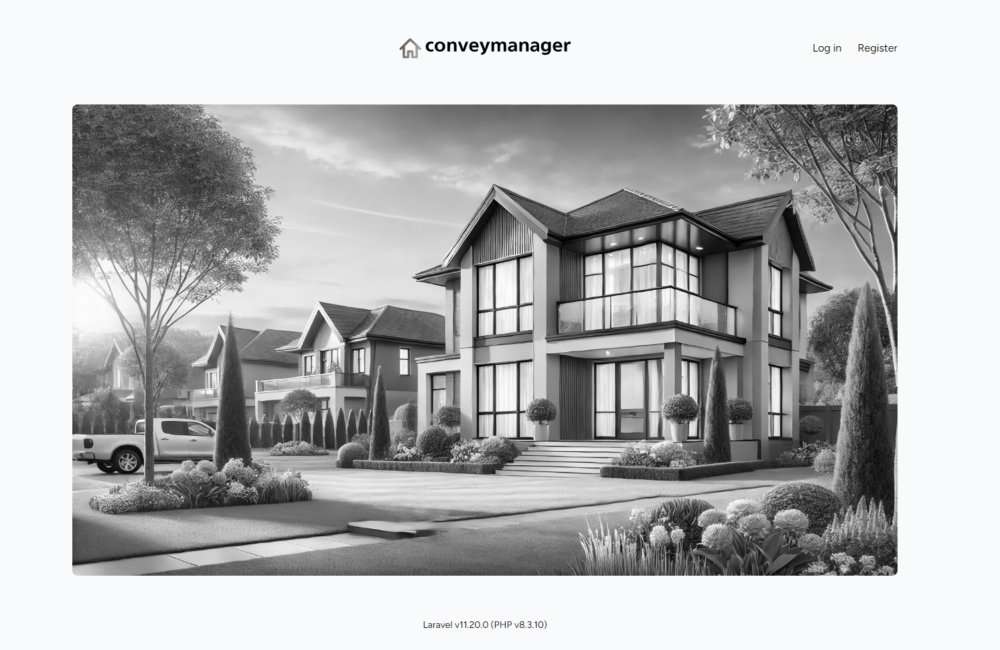
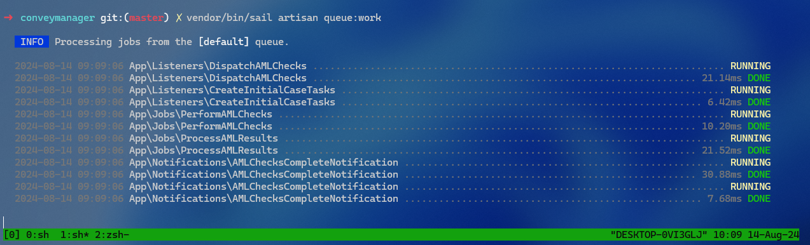

## Conveymanager


Certainly! Here’s a revised version of that paragraph:

This project is a showcase of a modern web application developed with Laravel 11 and Inertia.js + VueJS 3, highlighting key features and best practices. While it focuses on demonstrating fundamental concepts, it does not delve into more advanced techniques such as Domain-Driven Design (DDD), service and repository patterns, or event sourcing. For a more complex system that incorporates these advanced methodologies, you can explore the search engine I built from scratch on GitHub: [CrawlQuery](https://github.com/crawlquery/crawlquery).

Below, you'll find screenshots illustrating various features of this application, along with references to the related code files.


### Installation with docker

```
git clone git@github.com:rdcx/conveymanager.git; cd conveymanager/

docker run --rm \
    -u "$(id -u):$(id -g)" \
    -v "$(pwd):/var/www/html" \
    -w /var/www/html \
    laravelsail/php83-composer:latest \
    composer install --ignore-platform-reqs;

vendor/bin/sail up -d
```

### Tests

There are a few Pest tests included in the example.

- `tests/Feature/ProcessAMLChecksTest.php`

### Notable areas of development

- `routes/web.php`
- `app/Policies`
- `app/Jobs`
- `app/Listeners`
- `app/Http/Controllers`
- `app/Http/Requests`

## Jobs, Listeners & Notifications

This application includes several jobs, listeners, and notifications to handle background processing efficiently. Below is a snapshot of the job queue in action.



**Related Code Files:**
- `app/Listeners/DispatchAMLChecks.php`
- `app/Jobs/PerformAMLChecks.php` 
- `app/Jobs/ProcessAMLResults.php`
- `app/Notifications/AMLChecksCompleteNotification.php`

## Add Clients

This section allows users to add new clients to the system.


**Related Code Files:**
- `resources/js/Pages/Clients/Create.vue`
- `app/Http/Controllers/ClientController.php`

## Create Property

Conveyancers / Admins can create new properties.


**Related Code Files:**
- `resources/js/Pages/Property/Create.vue`
- `app/Http/Controllers/PropertyController.php`

## Open Cases

Open cases within a property.


**Related Code Files:**
- `resources/js/Pages/ConveyancingCase/Create.vue`
- `app/Http/Controllers/CaseController.php`

## Show Property Cases

Users can navigate through different cases to view details or make updates.


**Related Code Files:**
- `resources/js/Pages/Property/Show.vue`
- `app/Http/Controllers/CaseController.php`

## Update Cases and Tasks

This feature allows users to update tasks related to a specific case.


**Related Code Files:**
- `resources/js/Pages/ConveyancingCase/Edit.vue` 
- `app/Http/Controllers/TaskController.php`

